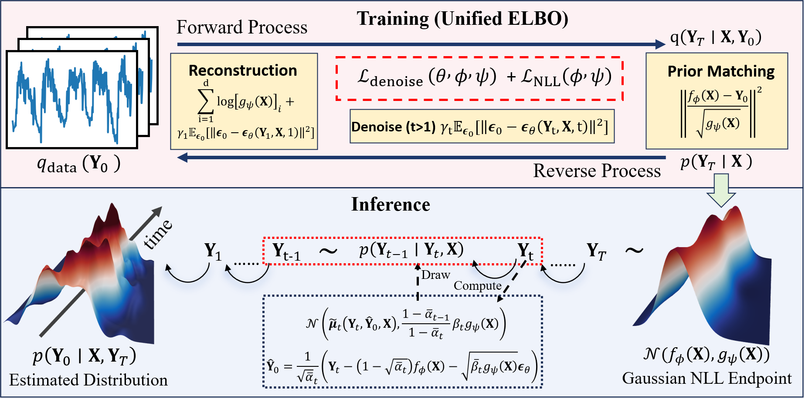

This is the official repo of "DiffPTS: Rethinking Diffusion ELBO for Probabilistic Time Series Forecasting" 

# 1 DiffPTS
DiffPTS rethinks the ELBO of recent advancements for probabilistic time series forecasting, and propose a new framework that unifies recent methods.
<p align="center">
  
</p>


# 2 install requirements

```
pip install -r ./requirements.txt
```

# 3 run
The dataset will be downloaded automatically

see ./scripts/ for examples.

```python
bash ./scripts/DiffPTS/ETTh1.sh
```


